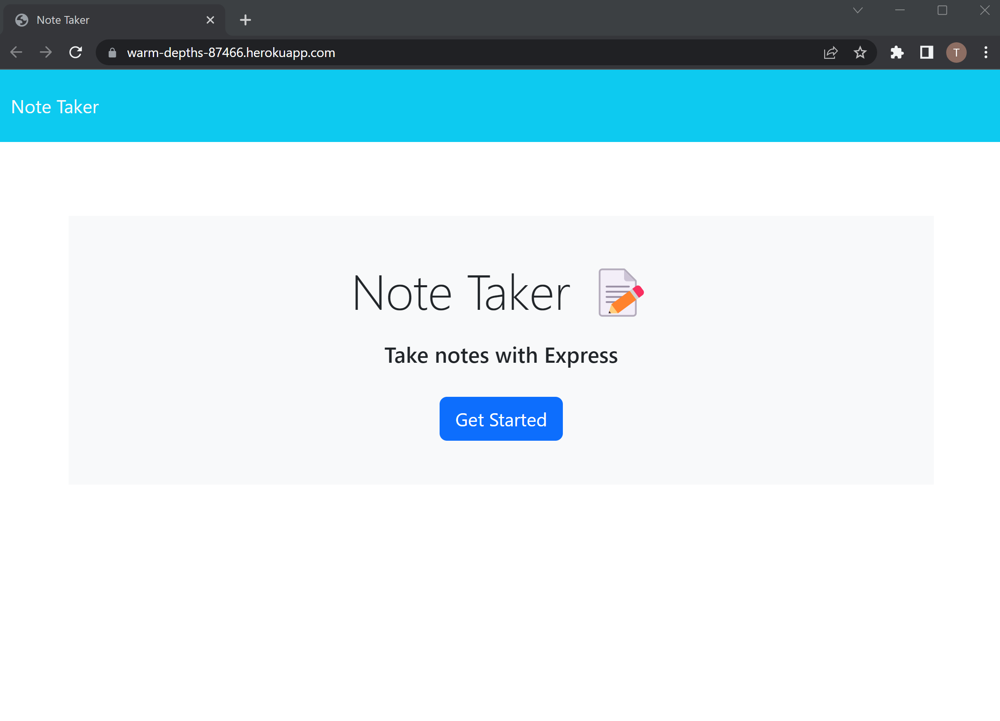
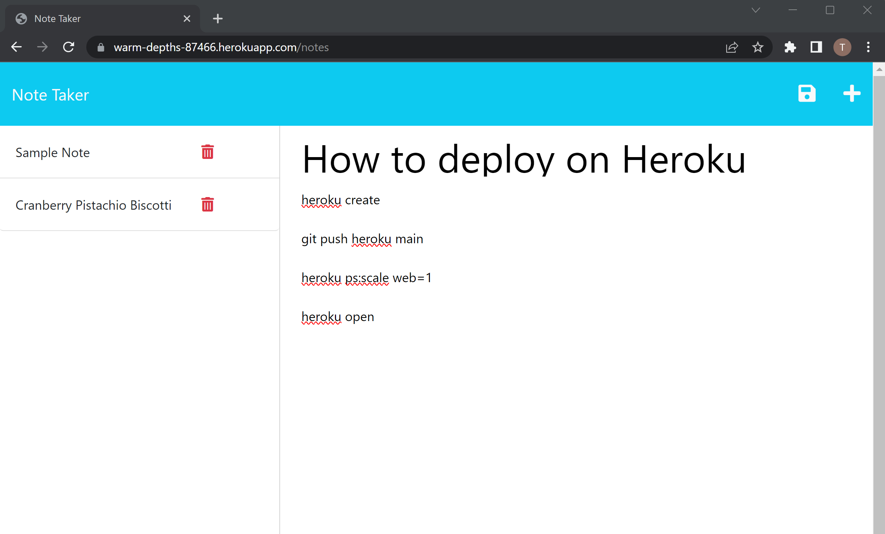
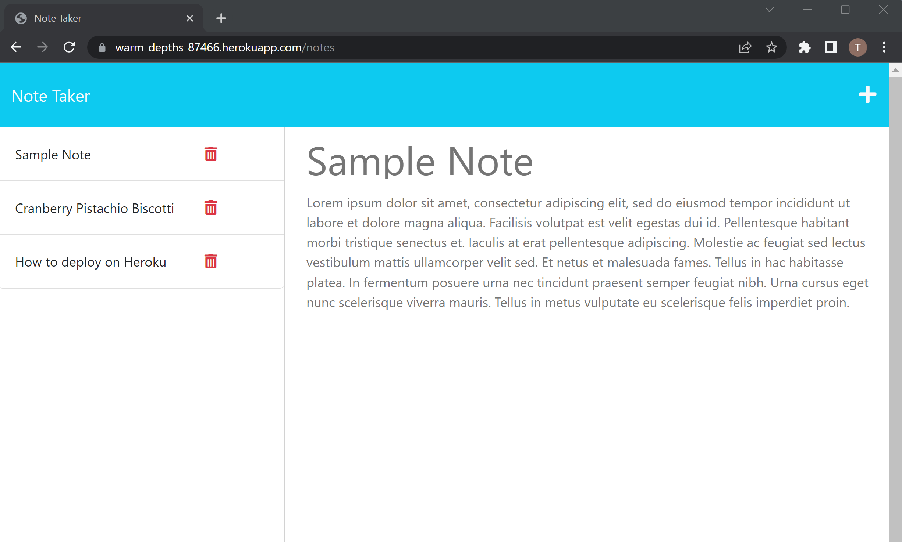

# M11- Simple Note Taker

## Description
This application is made for and developed by students of coding bootcamp to generate an app using Express for back-end development as well as deployment on Heroku instead of github pages. This is also a handy application for note taking. It will save your notes in a JSON file with its own unique ID. When you are finished with a note, you may also delete it.

## Installation
Please do `git clone` of this repo and an `npm i` and `node server.js` or `npm start` to start application with localhost or visit the deployed application on Heroku (may be taken down after awhile because I am a poor student who can not pay for this application long term)

## Usage
Deployed application at Heroku: https://warm-depths-87466.herokuapp.com/

Video walkthrough of app: https://drive.google.com/file/d/1laW76aolFHvfoFpO5fo_d5klDkRX13Es/view

## Licenses
MIT License

## Contributing
Feel free to clone or fork this repo and generate any changes or updates you would like. Or use it as a reference for your own application.

## Credits
* Sample text generator: https://loremipsum.io/generator/?n=1&t=p
* Sample recipe note: https://www.allrecipes.com/recipe/10638/cranberry-pistachio-biscotti/
* Learn express JS: https://www.youtube.com/watch?v=SccSCuHhOw0&ab_channel=WebDevSimplified
* Starter code: https://github.com/coding-boot-camp/miniature-eureka
* Heroku guide: https://devcenter.heroku.com/articles/getting-started-with-nodejs?singlepage=true
